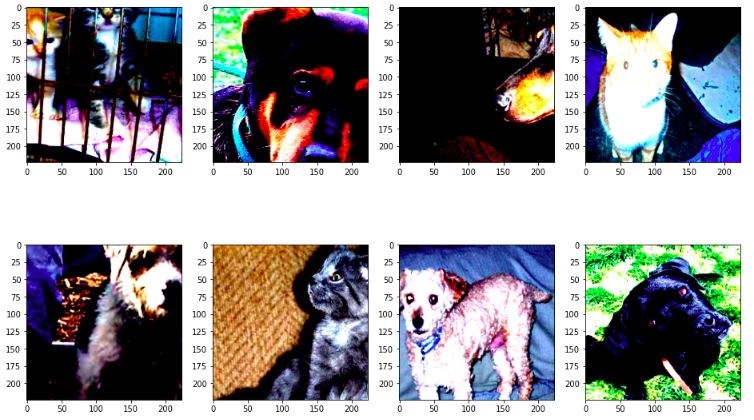
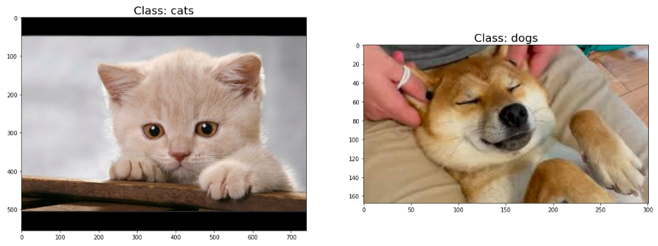

## Cats vs Dogs Classification

Сompleted tasks:
* Keras:
  * preprocessing(load images, data augmentation)
  * training pre-trained InceptionV3 model
* PyTorch:
  * preprocessing(load images, data augmentation)
  * training pre-trained resnet18 model

